<p align="center">
  
</p>

<p align="center">
  <a href="https://www.linkedin.com/in/bhavani-shankar-rangam-4a00b6230"></a>
  <a href="mailto:Bshankar5155@gmail.com"></a>
  
  
</p>

---

### 🧬 `whoami`

<p align="center">
  
</p>

### ⚡ What I Do

<table>
<tr>
<td width="50%" valign="top">

**🤖 Agentic AI**
- Stateful LangGraph workflows with tool calling, memory and checkpointing
- Supervisor-worker & planner-executor multi-agent systems
- Human-in-the-loop for high-stakes decisions

</td>
<td width="50%" valign="top">

**📚 Retrieval & RAG**
- Embeddings, pgvector, FAISS, Pinecone, ChromaDB
- Hybrid search, metadata filtering, reranking
- Grounded, source-cited LLM answers

</td>
</tr>
<tr>
<td width="50%" valign="top">

**🧪 Evaluation & LLMOps**
- RAGAS, LangSmith, MLflow for faithfulness & groundedness
- Prompt versioning, guardrails, fallback models
- Docker, Kubernetes, GitHub Actions CI/CD

</td>
<td width="50%" valign="top">

**🧠 Machine Learning**
- scikit-learn, XGBoost, classification & anomaly detection
- NLP with spaCy & Transformers, OCR pipelines
- Model inference services with FastAPI

</td>
</tr>
</table>

---

### 🛠️ Toolbox

<p align="center">
  <br/><br/>
  
</p>

<p align="center">
  
  
  
  
  
  
  
  
  
  
  
</p>

---

### 🚀 Featured Work

| | Project | What it does | Stack |
|:-:|---|---|---|
| 🧭 | **Meridian AI** | Production AI application | Python · LangGraph · RAG · FastAPI |

---

### 🗺️ Journey

```
2020 ──●── Software Developer, AI & ML ······· HSBC Global IT Services
       │   ML models, NLP pipelines, model inference services
2021 ──●── Software Developer, AI & Automation · Dell Technologies
       │   RAG pipelines, LangGraph agents, LLM-powered Q&A APIs
2024 ──●── Generative AI / Agentic AI Engineer
           Multi-agent systems, RAG platforms, LLM evaluation & LLMOps
```

<details>
<summary><b>🎓 Education & Certifications</b></summary>
<br/>

- **Master of Information Technology** — Governors State University, IL
- **B.E. Electrical & Electronics Engineering** — Osmania University, Hyderabad
- Microsoft Certified: Copilot for Microsoft 365 Specialist
- AI/ML Foundations Certification · Prompt Engineering Certification
- UiPath Certified Professional – Advanced RPA Developer
- Automation Anywhere Certified Advanced RPA Developer
- Power Automate & Power Platform Fundamentals

</details>

---

### 📊 GitHub Pulse

<p align="center">
  
  
</p>

<p align="center">
  
</p>

<p align="center">
  
</p>


